# Native visual review

These are screenshots of the real Terigo app running on an iPhone simulator, captured by XCTest. The contact sheets only resize and arrange those screenshots. Fixtures contain synthetic routes, activities, and account data; map tiles and weather may come from their normal providers.

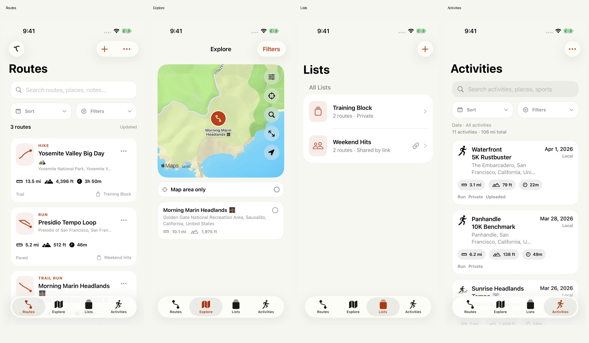

## Source and results

- [Native simulator run](https://github.com/yaportmax/Terigo/actions/runs/34747827197): **45 tests passed, 0 failed, 0 skipped**.
- [Tested code](https://github.com/yaportmax/Terigo/commit/e73411894918e458264587f79779e855317a8981): `e73411894918e458264587f79779e855317a8981`.
- Xcode 26.6, iPhone 17 Pro simulator, iOS 26.4.1. Debug build, without distribution signing.
- 75 native screenshots, all visually inspected. Full results and merge/head/base provenance are in [test-summary.json](test-summary.json) and [validation.json](validation.json).
- The gallery commit adds documentation and images after the tested code commit. PR security-analysis status is reported separately by GitHub checks.

## Selected original screenshots

| Screen | Original capture |
| --- | --- |
| Routes Light | [View](routes-light.png) |
| Routes Dark | [View](routes-dark.png) |
| Explore | [View](explore.png) |
| Lists | [View](lists.png) |
| Activities | [View](activities.png) |
| Activity Analysis | [View](activity-analysis.png) |
| Route Details | [View](route-details.png) |
| Full Screen Map | [View](full-screen-map.png) |
| Route Organization | [View](route-organization.png) |
| Offline | [View](offline.png) |
| Sharing | [View](sharing.png) |
| Export | [View](export.png) |
| Tracking Finished | [View](tracking-finished.png) |
| Large Text | [View](large-text.png) |
| Landscape | [View](landscape.png) |
| Welcome | [View](welcome.png) |

## Complete contact sheets

The [screenshot index](screenshots.json) maps every capture to its contact sheet and records the original PNG digest.

### Sheet 1

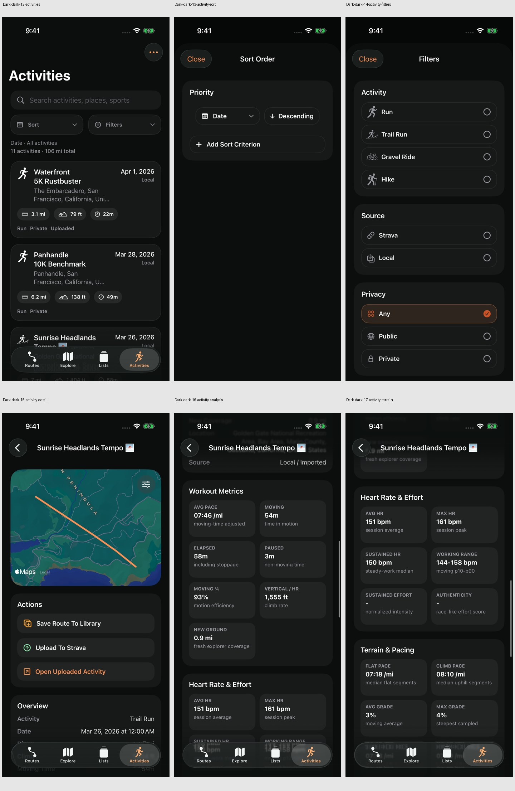

### Sheet 2

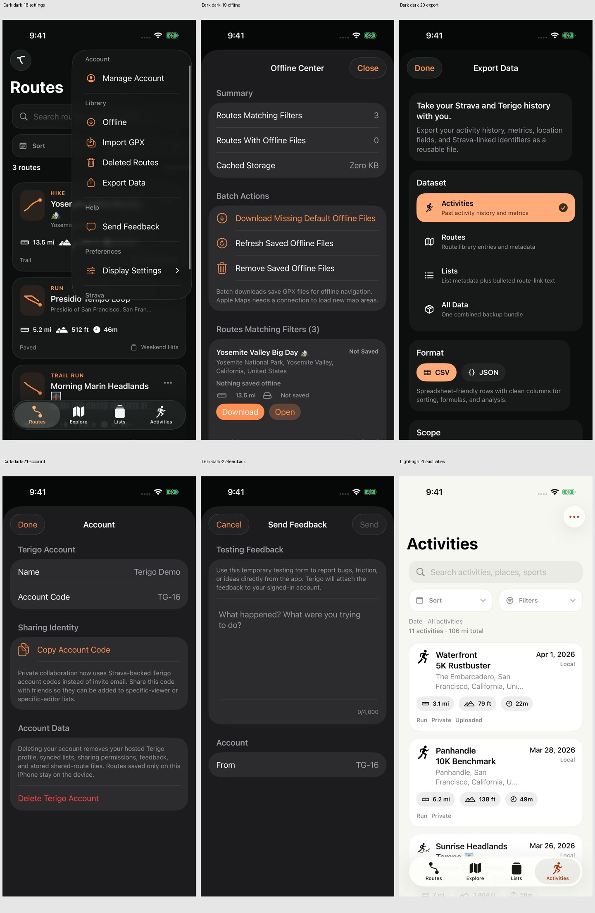

### Sheet 3

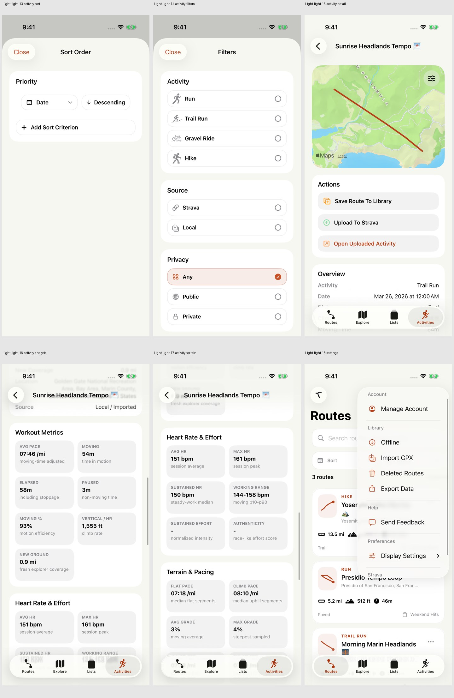

### Sheet 4

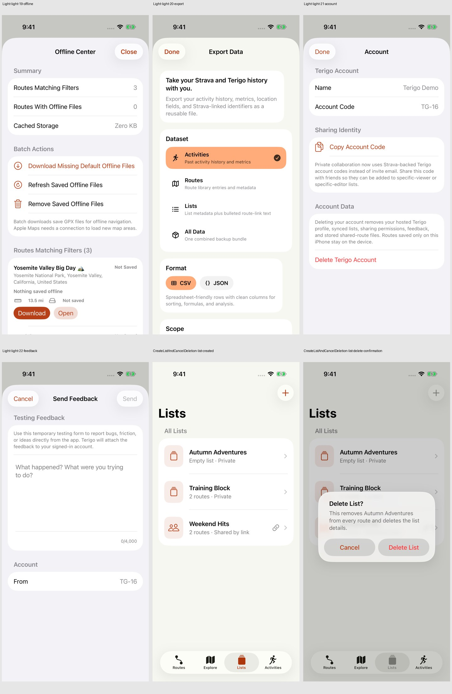

### Sheet 5

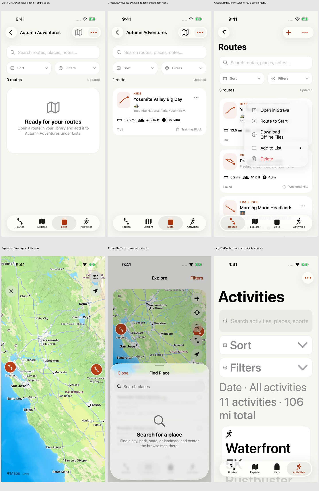

### Sheet 6

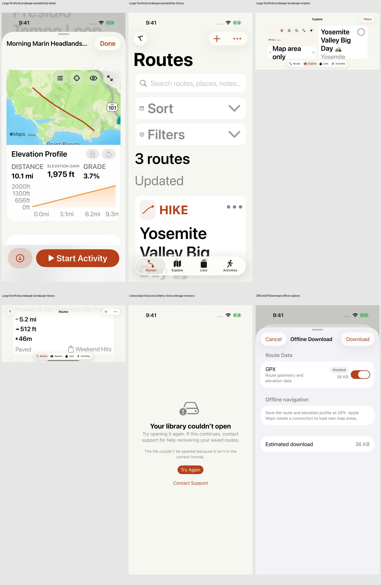

### Sheet 7

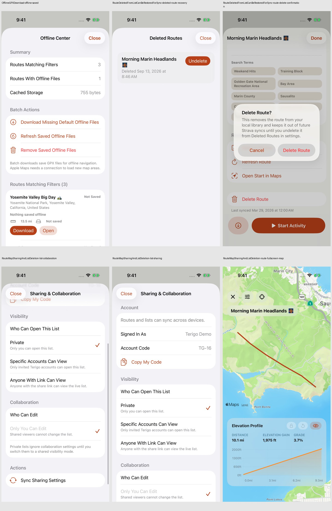

### Sheet 8

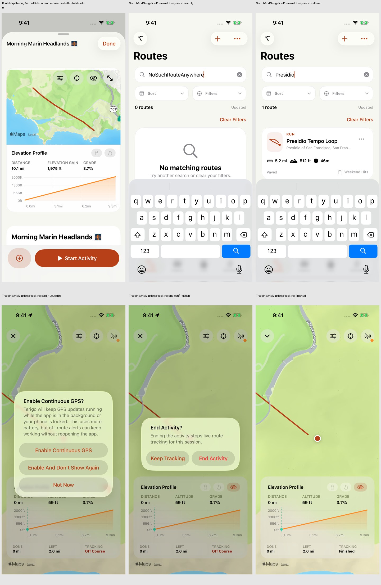

### Sheet 9

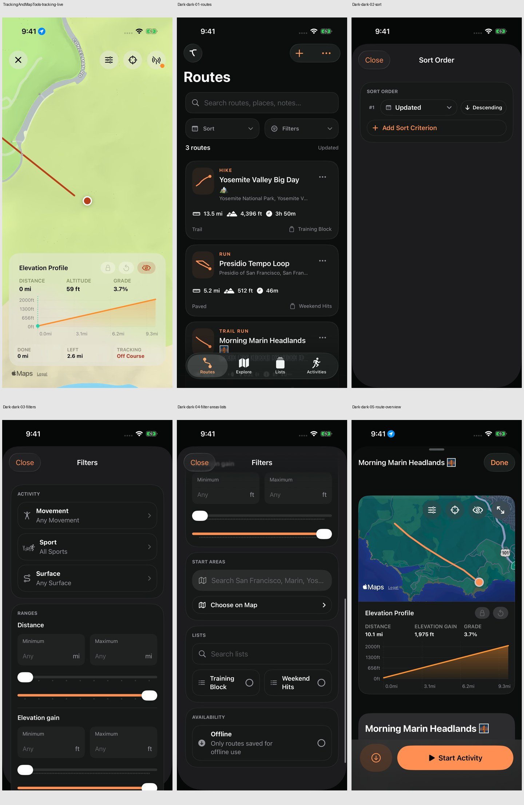

### Sheet 10

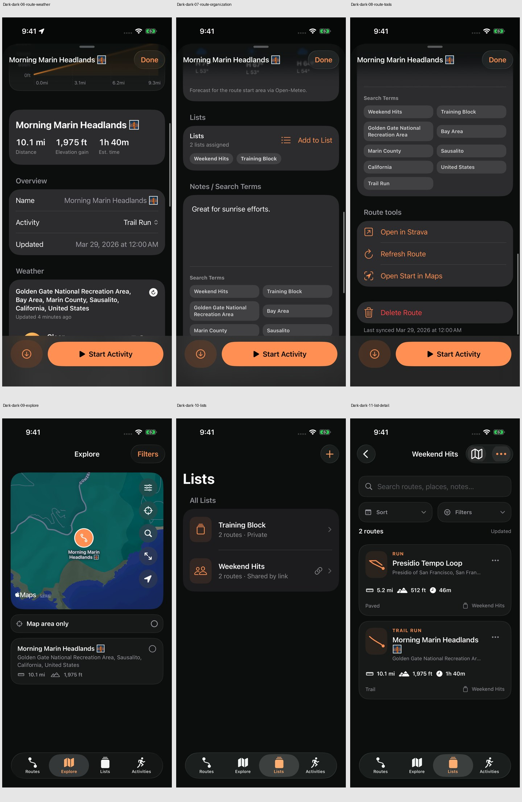

### Sheet 11

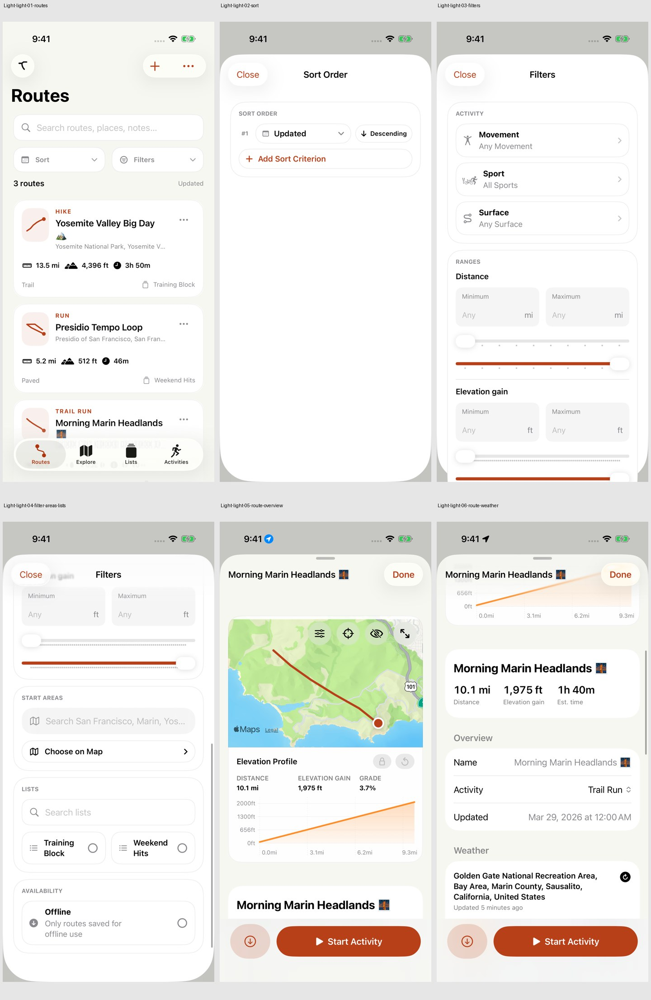

### Sheet 12

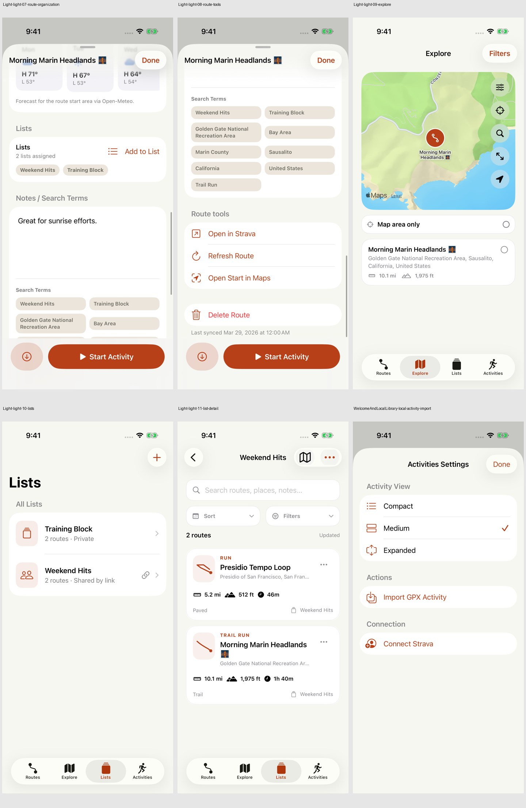

### Sheet 13

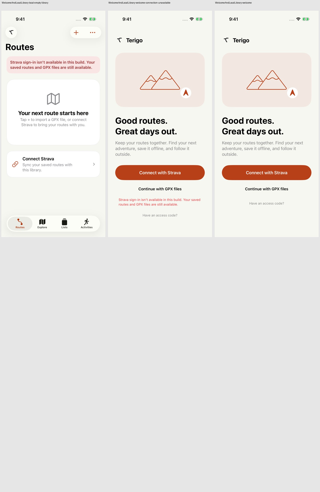

## Review coverage and limits

The native suite exercises the four destinations, light/dark appearance, search and empty results, sort/filter sheets, route details and elevation, activity metrics, offline GPX downloads, list creation and membership, deletion cancellation and recovery, sharing controls, full-screen maps and place search, tracking prompts and finish, welcome/local use, account, feedback, export, storage retry, large text, and landscape.

This verifies simulator behavior and presentation. It does not verify physical GPS accuracy, background battery use, real offline Mapbox tile downloads, hosted collaboration permissions, App Store signing, or production OAuth. The auth-broker hostname documented in the repository returned public DNS NXDOMAIN on 13 September 2026; a live broker must be configured before connected release validation. Normal users sign in through Connect with Strava and do not enter developer API keys.
